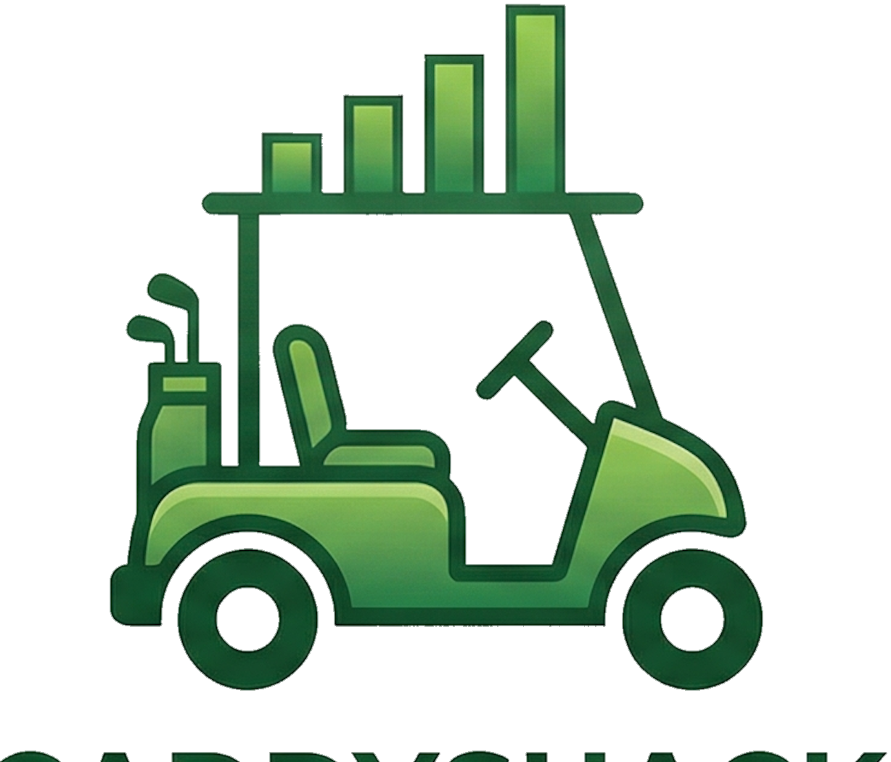
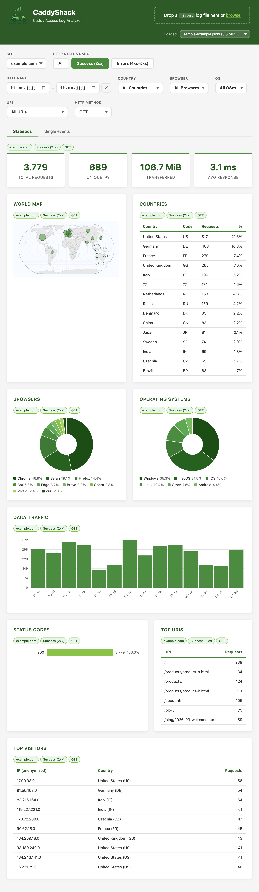
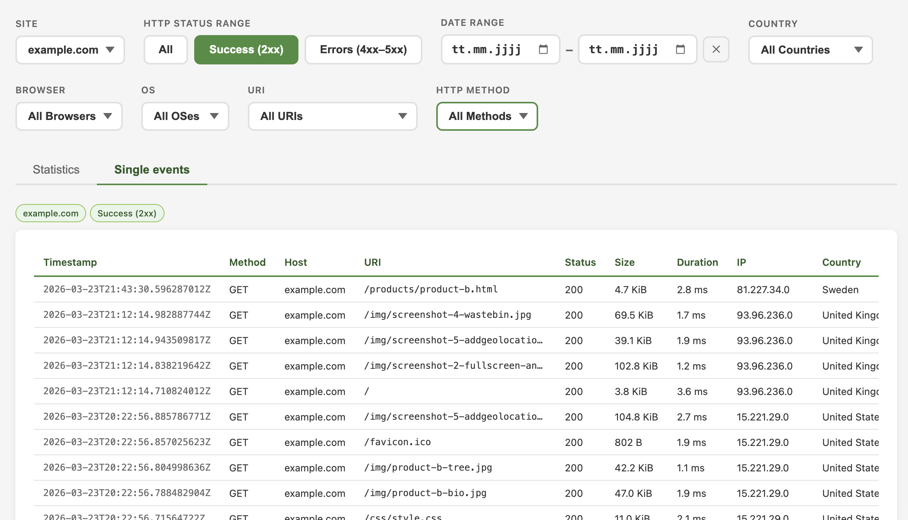

# CaddyShack



A web-based analytics dashboard for [Caddy](https://caddyserver.com/) access logs. Upload a JSONL log file and get instant visual insights: traffic trends, browser and OS breakdowns, geographic distribution on a world map, top pages, status codes, raw event log, and more — entirely in your browser, with no data leaving your machine.

## Screenshots

*Statistics overview*



*Single log entries*



## Features

- **Drag-and-drop upload** of Caddy JSONL access logs — no configuration needed, just drop the file
- **Summary cards**: total requests, unique IPs, data transferred, and average response time at a glance
- **World map** with proportional bubbles showing where your visitors come from (requires optional GeoIP database)
- **Browser & OS statistics** with interactive D3.js donut charts (green palette) showing user-agent breakdowns
- **Daily traffic** trend chart to spot spikes and patterns over time
- **HTTP status code** breakdown — see 2xx, 3xx, 4xx, and 5xx ratios visually
- **Top pages** listing the most-visited URIs (static assets automatically excluded)
- **Top visitors** with anonymized IPs and country attribution
- **Single Events tab** — scroll through raw log entries (most recent first) with lazy loading; 4xx/5xx rows highlighted in red
- **Multi-host support** — analyze logs containing multiple virtual hosts, with per-host filtering
- **9-dimension filtering** — filter by site, HTTP status range, date range, country, browser, OS, page, and HTTP method simultaneously; all filters are applied on the backend with AND logic in a single streaming pass
- **Filter hint badges** per panel — each chart and table shows which filters are currently active
- **GDPR-compliant** IP anonymization: last octet zeroed for IPv4, prefix truncated for IPv6
- **Offline-first frontend** — D3.js and TopoJSON are served locally, no CDN calls

## Download

Pre-built binaries for each release are available on the [GitHub Releases](https://github.com/bjblazko/caddyshack/releases) page:

| Platform | Architecture | File |
|----------|-------------|------|
| Linux | amd64 | `caddyshack-vX.Y.Z-linux-amd64` |
| Linux | arm64 | `caddyshack-vX.Y.Z-linux-arm64` |
| macOS | amd64 (Intel) | `caddyshack-vX.Y.Z-darwin-amd64` |
| macOS | arm64 (Apple Silicon) | `caddyshack-vX.Y.Z-darwin-arm64` |
| Windows | amd64 | `caddyshack-vX.Y.Z-windows-amd64.exe` |

Download the binary for your platform, make it executable, and run it — no installation required.

## Container

Images for `linux/amd64` and `linux/arm64` are published to GHCR on every release.

**Run directly:**

```sh
docker run -p 8080:8080 ghcr.io/bjblazko/caddyshack:latest
```

**With GeoIP support** (mount a local `data/` directory containing `dbip-country-lite.csv`):

```sh
docker run -p 8080:8080 -v ./data:/app/data:ro ghcr.io/bjblazko/caddyshack:latest
```

**With Compose** (uses the included [`compose.yml`](compose.yml)):

```sh
docker compose up -d
# or with Podman:
podman compose up -d
```

`podman` and `podman compose` are drop-in replacements for all commands above.

## Quick Start

### Prerequisites

- Go 1.25 or later (only needed to build from source)

### Build from Source

```sh
go build -o caddyshack .
./caddyshack
```

Open [http://localhost:8080](http://localhost:8080) in your browser and upload a Caddy `.jsonl` log file.

### Command-Line Flags

| Flag | Default | Description |
|------|---------|-------------|
| `-addr` | `:8080` | Listen address (host:port) |
| `-geodb` | `./data/dbip-country-lite.csv` | Path to DB-IP country-level CSV |

### GeoIP Setup (Optional)

For country-level geographic data, download the free [DB-IP Lite](https://db-ip.com/db/download/ip-to-country-lite) CSV and place it at `./data/dbip-country-lite.csv` (or specify a custom path with `-geodb`). Without it, the app works normally but country data shows as `??`.

## Log Format

CaddyShack expects Caddy's native JSON access logs (JSONL — one JSON object per line). Enable logging in your Caddyfile:

```caddyfile
example.com {
    log {
        output file /var/log/caddy/access.json {
            roll_size  50MiB
            roll_keep  7
            roll_keep_for 168h
        }
        format json
    }
}
```

See [doc/spec/log-format.md](doc/spec/log-format.md) for the full field specification.

## Architecture

CaddyShack is designed around three principles:

- **Filter-then-aggregate** — all filter dimensions (host, date range, country, browser, OS, page, HTTP status, HTTP method) are applied on the backend with AND logic in a single streaming pass before any aggregation. Every filter combination is accurate by construction; no client-side re-aggregation.
- **Streaming** — logs are parsed line-by-line with `bufio.Scanner`. Memory usage grows with the number of unique values (IPs, pages, countries), not with the number of log lines.
- **No frameworks** — pure Go standard library (`net/http`) on the backend, vanilla HTML/CSS/JavaScript on the frontend. No external Go dependencies; deployment is a single binary.

Uploaded files are saved to the OS temp directory under a random hex ID so filter changes can re-analyze the same file without re-uploading.

## Test Data

A sample log generator is included at `testdata/generate.py`. Run it to produce synthetic Caddy JSONL log files for development and testing. A pre-generated sample (`testdata/sample-example.jsonl`) is included in the repository.

## Project Structure

```
caddyshack/
├── main.go                    # Entry point, routing, server
├── internal/
│   ├── logparser/             # JSONL stream parser
│   ├── useragent/             # Browser & OS detection
│   ├── anonymize/             # IP anonymization
│   ├── geoip/                 # DB-IP CSV loader & lookup
│   ├── analyzer/              # Aggregation engine
│   └── handler/               # HTTP handlers
├── static/                    # Frontend (vanilla HTML/JS/CSS)
│   ├── index.html
│   ├── css/style.css
│   ├── js/                    # app.js, charts.js, map.js
│   ├── vendor/                # D3.js, topojson-client (local)
│   ├── data/                  # World TopoJSON
│   └── img/                   # Logo
├── data/                      # GeoIP CSV (not shipped, download separately)
├── testdata/                  # Sample logs and generator script
└── doc/spec/                  # Project specification
```

## Technology Stack

- **Backend**: Go (stdlib `net/http`, no frameworks, no external dependencies)
- **Frontend**: Vanilla HTML, CSS, JavaScript
- **Charts**: Canvas 2D API
- **World Map**: D3.js + TopoJSON (served locally, no CDN)
- **Geography**: Natural Earth 110m country boundaries
- **GeoIP**: DB-IP Lite CSV (optional, loaded at startup)

## License

[Apache License 2.0](LICENSE)
