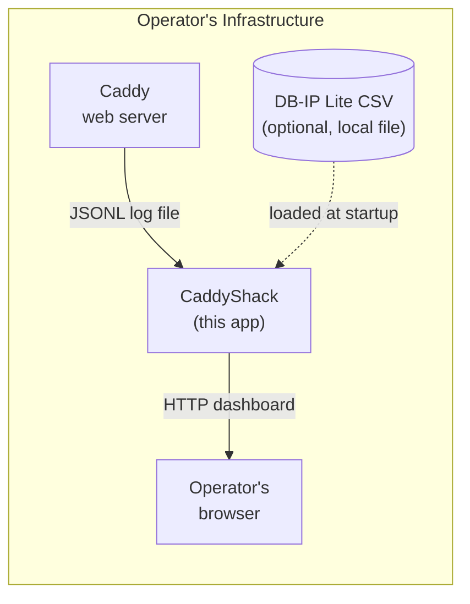

# 3. Context and Scope

## Business Context

CaddyShack sits between the operator's Caddy web server (which writes access logs) and the operator's browser (which displays analytics). It does not connect to any external service at runtime.

## Technical Context

### Interfaces

| Interface | Direction | Protocol | Format |
|-----------|-----------|----------|--------|
| Log file upload | Browser → CaddyShack | HTTP multipart/form-data | JSONL |
| Server-side log list | Browser → CaddyShack | HTTP GET | JSON |
| Server-side log analysis | Browser → CaddyShack | HTTP GET | JSON |
| Dashboard delivery | CaddyShack → Browser | HTTP GET | HTML/CSS/JS |
| Analysis result | CaddyShack → Browser | HTTP JSON | `MultiHostReport` |
| GeoIP database | Filesystem → CaddyShack | File read at startup | CSV |

### External Systems

| System | Role | Required? |
|--------|------|-----------|
| Caddy v2 | Produces the JSONL access logs consumed by CaddyShack | Yes (input source) |
| DB-IP Lite CSV | Maps IPv4 ranges to country codes | No (optional; country data absent if missing) |
| GitHub Container Registry | Hosts published Docker images | No (distribution only) |
| GitHub Actions | Builds and publishes release artifacts | No (CI/CD only) |

### What Is Out of Scope

- Real-time log tailing (CaddyShack analyzes static snapshots)
- Authentication or multi-user access control
- IPv6 GeoIP resolution
- Log formats other than Caddy v2 JSONL
- Alerting or threshold notifications
