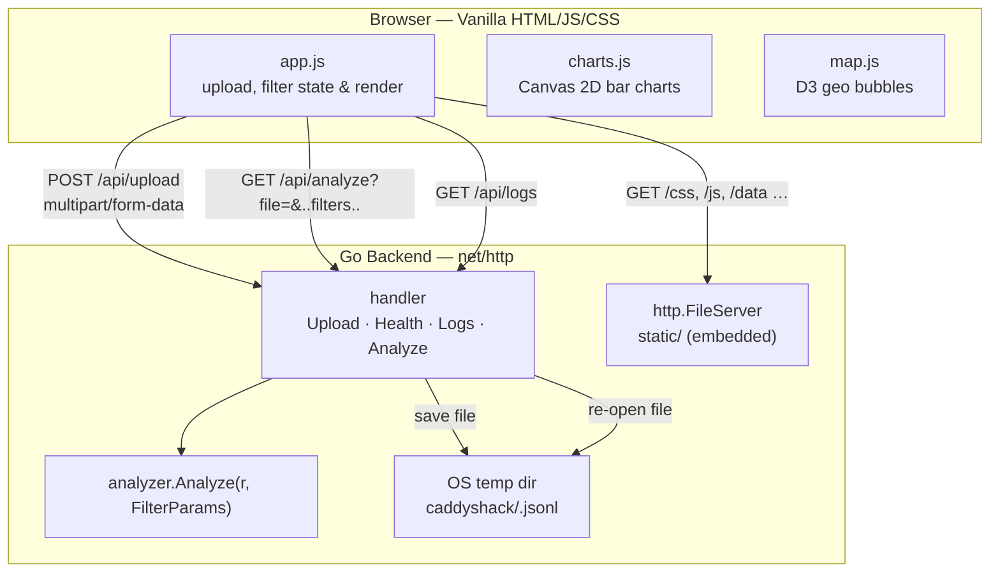
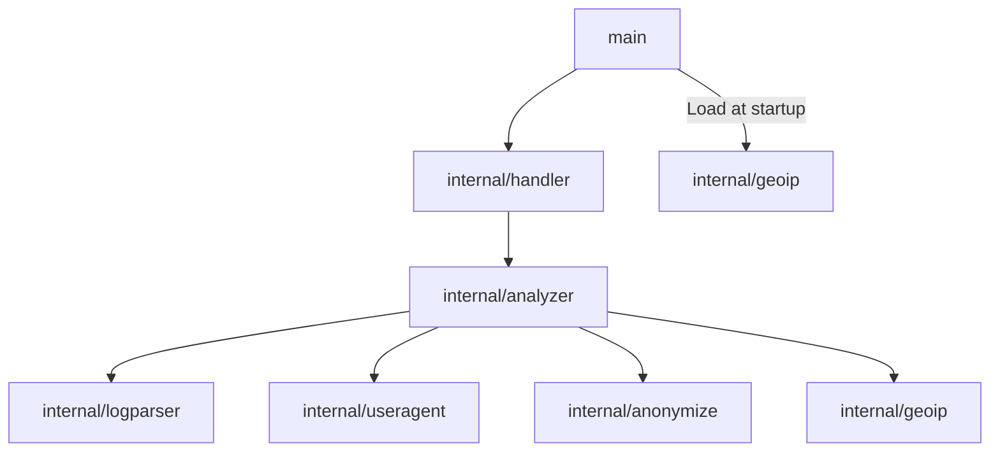

# 5. Building Block View

## Level 1 — System Decomposition

## Level 2 — Go Package Decomposition

### Package Dependency Graph

No circular dependencies. Each package has a single responsibility.

### Package Responsibilities

| Package | Responsibility |
|---------|---------------|
| `main` | Entry point: parse CLI flags, load GeoIP database, register routes, start HTTP server |
| `internal/handler` | HTTP request/response boundary: parse multipart upload, save to temp dir, parse filter query params, enforce size limits, JSON-encode responses |
| `internal/analyzer` | Core aggregation engine: single streaming pass with AND filter logic (via `FilterParams`), host collection, counter maps → `AnalysisResult` |
| `internal/logparser` | JSONL deserialization: read line-by-line with `bufio.Scanner`, decode JSON, expose `LogEntry` structs |
| `internal/useragent` | User-Agent string parsing: ordered string matching to detect browser and OS names |
| `internal/anonymize` | IP anonymization: zero last IPv4 octet; truncate IPv6 to first 3 groups |
| `internal/geoip` | GeoIP lookup: load DB-IP Lite CSV into sorted uint32 slices; binary-search lookup; country name resolution |

### Frontend Modules

| Module | Responsibility |
|--------|---------------|
| `app.js` | Main orchestrator: file upload, filter state management, `GET /api/analyze` on every filter change, DOM population, dimension dropdown repopulation, filter hints |
| `charts.js` (`Charts` namespace) | Canvas 2D horizontal and vertical bar charts with DPR scaling |
| `map.js` (`WorldMap` namespace) | D3.js Natural Earth bubble map with proportional sizing and hover tooltips |

### Key Data Types

| Type | Owner | Description |
|------|-------|-------------|
| `LogEntry` | logparser | Deserialized Caddy log line |
| `FilterParams` | analyzer | All active filter dimensions: host, start/end date, country, browser, OS, page, status |
| `AnalysisResult` | analyzer | Root response: optional `FileID`, `Hosts []string`, `Report *Report` |
| `Report` | analyzer | Aggregated metrics for the current filter combination |
| `NameCount` | analyzer | Generic `{name, count}` tuple |
| `DayCount` | analyzer | `{date, count}` for daily traffic |
| `VisitorInfo` | analyzer | `{ip, count, country, country_name}` for top visitors |
| `CountryCount` | analyzer | `{code, name, count}` for geographic breakdown |
