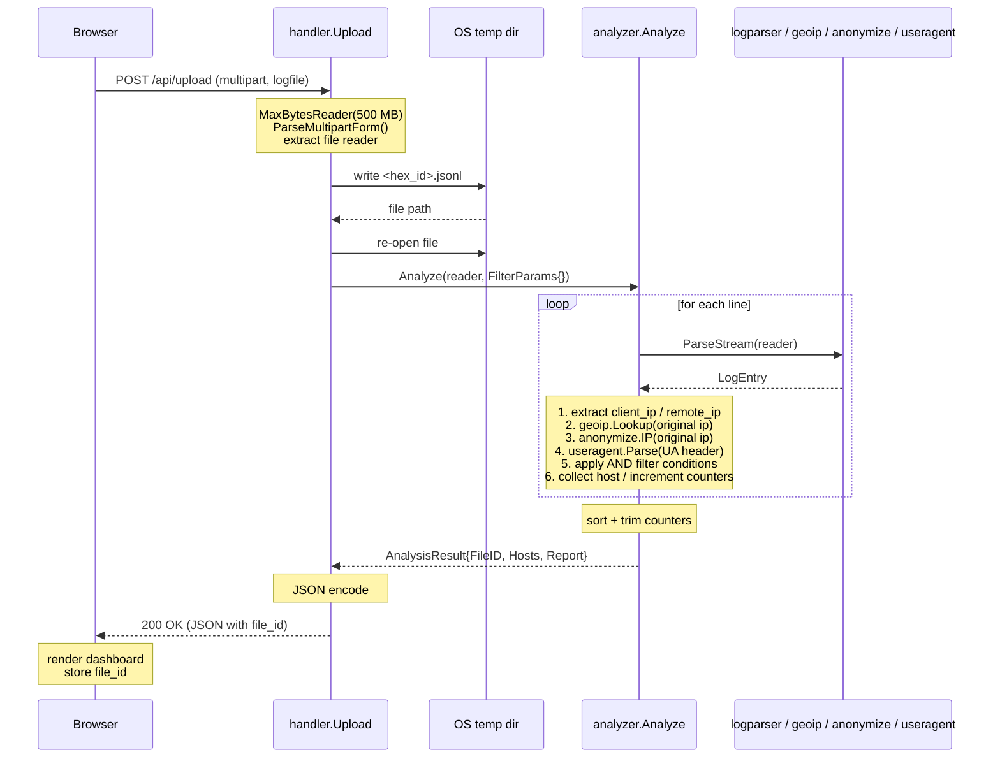
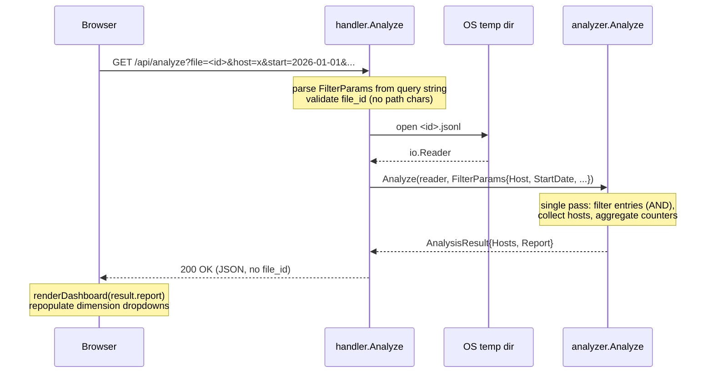
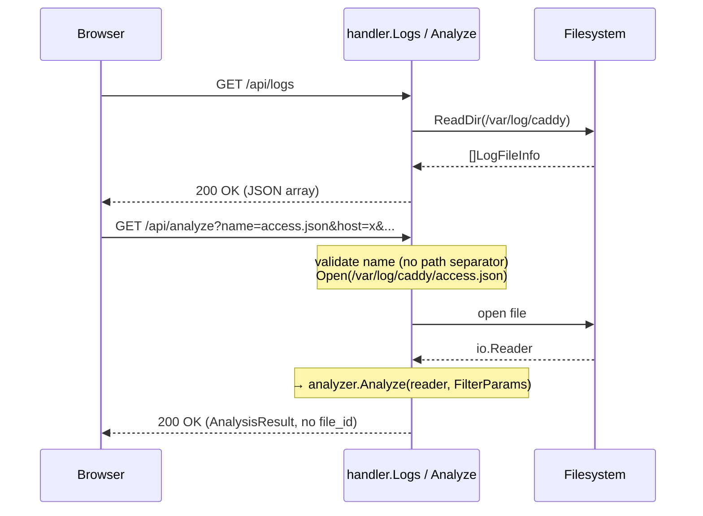
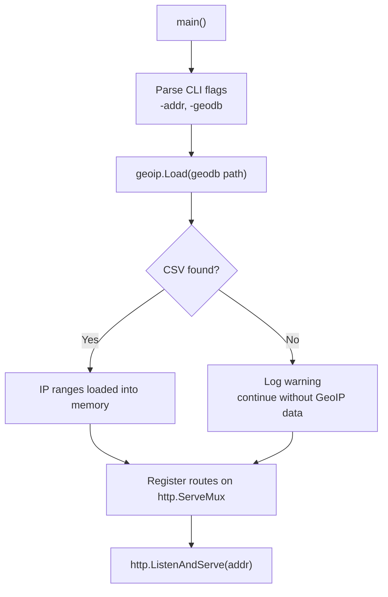

# 6. Runtime View

## Scenario 1: Browser Upload and Initial Analysis

The operator drops a log file onto the dashboard. The file is saved to the OS temp directory and immediately analyzed with no active filters.

---

## Scenario 2: Filter Change (Backend Re-Analysis)

After the initial upload, every filter change (host, status, date range, country, browser, OS, page) triggers a full backend re-analysis of the same temp file with the new `FilterParams`.

---

## Scenario 3: Server-Side Log Analysis

The operator selects a log file from the server's `/var/log/caddy` directory. On every filter change the file is re-read from disk (no temp copy needed).

---

## Startup

