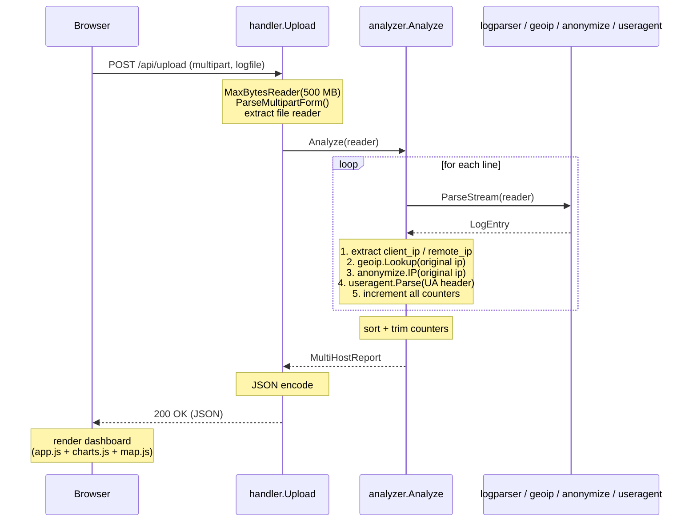
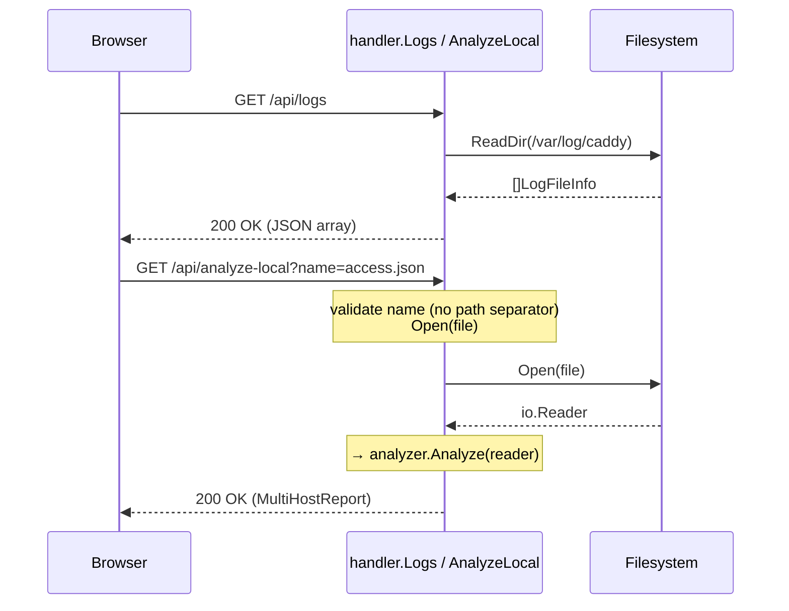
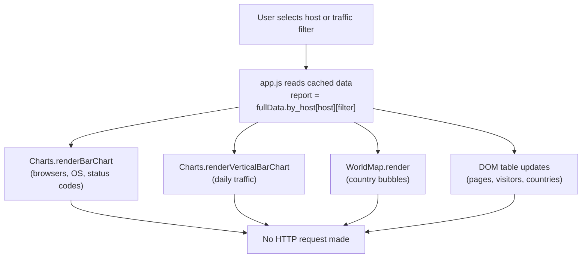
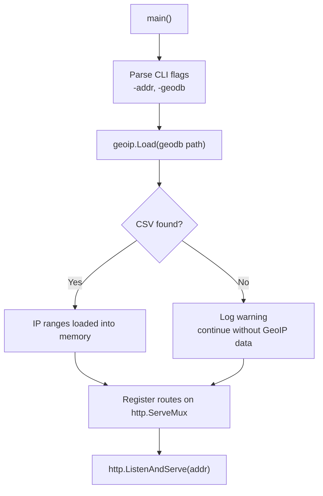

# 6. Runtime View

## Scenario 1: Browser Upload and Analysis

The primary use case: the operator drops a log file onto the dashboard.

**Memory lifecycle:** all parsed data (counters, maps) exists only within `analyzer.Analyze`. Once the JSON response is written, the memory is eligible for GC.

---

## Scenario 2: Server-Side Log Analysis

The operator selects a log file from the server's `/var/log/caddy` directory without uploading it.

---

## Scenario 3: Host / Filter Switch (Client-Side Only)

After the initial analysis, switching host or traffic filter requires no server call.

---

## Startup

