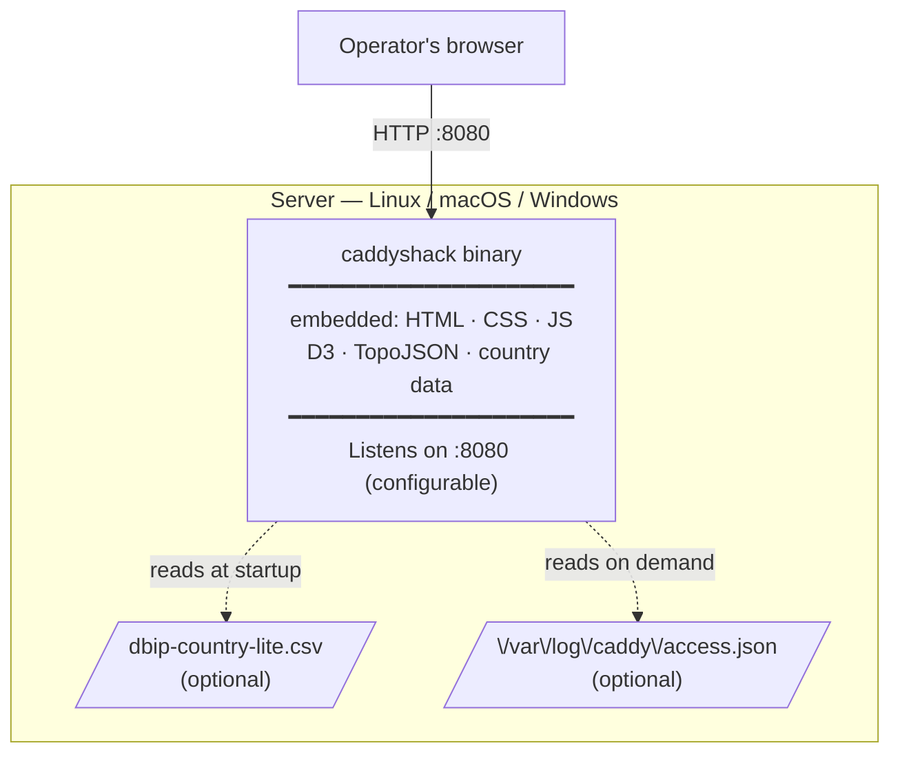
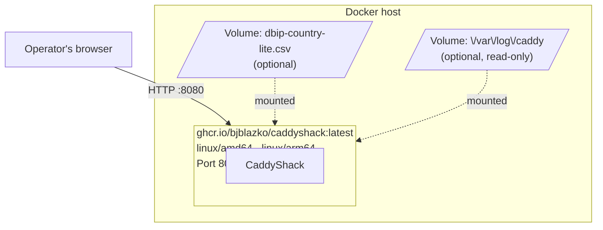
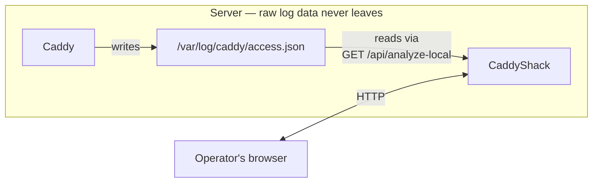

# 7. Deployment View

## Option A: Single Binary (Recommended)

The simplest deployment: copy the binary to the server and run it.



**Start:**
```sh
./caddyshack -addr :8080 -geodb ./dbip-country-lite.csv
```

**Platforms:** linux/amd64, linux/arm64, darwin/amd64, darwin/arm64, windows/amd64 (released via GitHub Actions on each tag).

---

## Option B: Docker



**Quick start:**
```sh
docker run -p 8080:8080 ghcr.io/bjblazko/caddyshack:latest
```

**With GeoIP and log access:**
```sh
docker run -p 8080:8080 \
  -v /data/dbip-country-lite.csv:/data/dbip-country-lite.csv \
  -v /var/log/caddy:/var/log/caddy:ro \
  ghcr.io/bjblazko/caddyshack:latest
```

**Docker Compose** (`compose.yml` in repository root) provides a ready-made service definition.

---

## Option C: Same Host as Caddy (Recommended for Server-Side Analysis)

When CaddyShack runs on the same host as Caddy, the `GET /api/logs` and `GET /api/analyze-local` endpoints allow the operator to analyze log files directly without downloading and re-uploading them.



---

## CLI Flags

| Flag | Default | Description |
|------|---------|-------------|
| `-addr` | `:8080` | TCP listen address |
| `-geodb` | `./data/dbip-country-lite.csv` | Path to DB-IP Lite CSV |

---

## Health Check

`GET /api/health` → `{"status":"ok"}`

Suitable for container readiness probes, reverse-proxy health checks, and uptime monitors.
