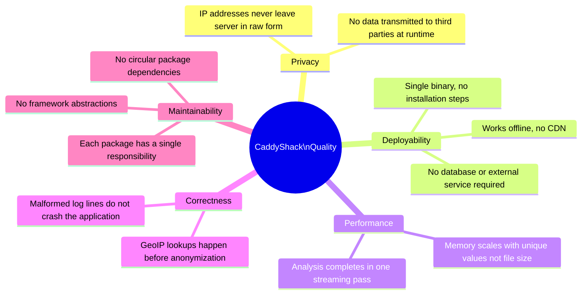

# 10. Quality Requirements

## Quality Tree

## Quality Scenarios

### Privacy

| Stimulus | Response | Measure |
|----------|----------|---------|
| Operator uploads a log file containing real visitor IPs | Only anonymized IPs appear in the API response and UI | 100% of IPs in the response have last IPv4 octet = 0 or IPv6 truncated to 3 groups |
| Browser requests the dashboard | No external HTTP requests are made | Zero requests to domains other than the CaddyShack host |

### Deployability

| Stimulus | Response | Measure |
|----------|----------|---------|
| Operator copies binary to a fresh server with no software installed | Dashboard is accessible | `./caddyshack` starts and serves the UI without any additional setup |
| Network is firewalled and has no internet access | Dashboard fully functional | All assets load; GeoIP degrades gracefully to `??` |

### Performance

| Stimulus | Response | Measure |
|----------|----------|---------|
| Operator uploads a 100 MB log file | Analysis completes | Single pass through the file; no out-of-memory error |
| Log file contains millions of entries | Memory usage remains bounded | RAM usage proportional to unique IPs/URIs, not total lines |

### Correctness

| Stimulus | Response | Measure |
|----------|----------|---------|
| Log file contains a truncated or malformed JSON line | Line is skipped; analysis continues | No 500 error; other entries processed normally |
| GeoIP CSV is absent at startup | Application starts normally | Warning logged; all country fields return `??`; no crash |
