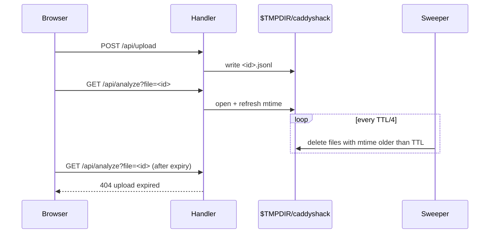

# ADR-010 — Delete idle uploads after a TTL

## Context

ADR-009 stores uploaded log files in the OS temp directory so that every filter
change can re-analyze them, and explicitly left cleanup to the OS. In practice
macOS and most Linux distributions keep `$TMPDIR` for days or until reboot,
and containers often never clean it. The files contain raw visitor IP
addresses, so they are personal data kept far longer than any analysis needs.

Options considered:

1. **Wipe on startup only** — simple, but files accumulate while the server runs.
2. **Fixed age after upload** — predictable, but an active user loses their
   file mid-session.
3. **Idle TTL** — delete a file once it has not been used for a set time.

## Decision

Option 3. Each upload's mtime is refreshed whenever `/api/analyze` or
`/api/events` reads it. A background goroutine periodically deletes uploads
whose mtime is older than `-upload-ttl` (default `1h`). The upload directory
is emptied on startup, since no client can hold a valid file ID across a
restart in practice. A failed upload is deleted immediately.

## Consequences

**Positive:**
- Raw IP data from uploads lives on disk for at most the TTL after last use
- No session state is introduced; the file's mtime is the only bookkeeping

**Negative / trade-offs:**
- A user who leaves the dashboard idle longer than the TTL must upload again
- The sweeper is one long-lived goroutine, the first background task in the
  process
