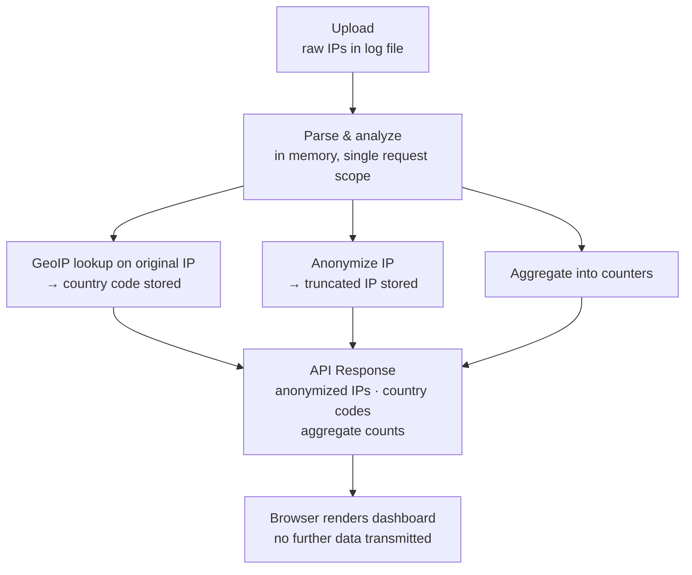

# CaddyShack Privacy & GDPR Considerations

## IP Anonymization

CaddyShack anonymizes all IP addresses before they appear in the API response or the browser UI.

| IP Version | Method | Example |
|------------|--------|---------|
| IPv4 | Zero the last octet | `93.184.216.34` → `93.184.216.0` |
| IPv6 | Keep first 3 groups, zero rest | `2a01:4f8:c17::1` → `2a01:4f8:c17::` |

This preserves enough information for geographic and network-level analysis while removing individual identification.

## Processing Model

- **Stateless**: CaddyShack does not store uploaded log files. Data exists only in memory for the duration of a single HTTP request.
- **No persistence**: there is no database, no log storage, no session tracking. Once the API response is sent, all parsed data is garbage-collected.
- **GeoIP before anonymization**: country lookups are performed on the original IP during analysis. Only the anonymized IP is included in the response.

## GeoIP Database

The optional DB-IP Lite CSV is loaded into memory at server startup. It contains IP range → country code mappings and is never exposed to the client. Only the resulting country code is included in the API response.

## Data Flow Privacy Properties

No raw IP addresses leave the server process. The uploaded file content is not written to disk beyond Go's standard multipart temp file handling (which is cleaned up automatically).

## Recommendations for Operators

- Run CaddyShack on the same server as the log files to avoid transmitting raw logs over the network
- If using CaddyShack remotely, upload pre-anonymized logs (e.g., processed by `caddy-stats anonymize`)
- The GeoIP database does not need to contain personally identifiable information; it maps IP ranges to country codes only
