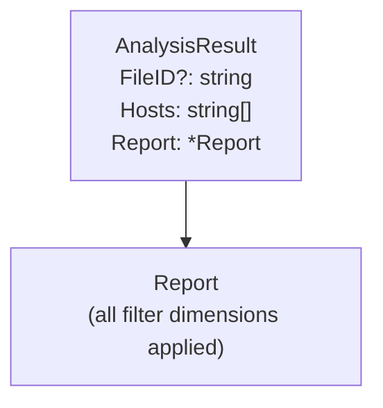

# Spec: Analysis & Aggregation

## Overview

`internal/analyzer` is the core aggregation engine. `Analyze(r io.Reader, params FilterParams)`
makes a single streaming pass over log entries, applies all filter conditions
with AND logic, and returns an `AnalysisResult`.

## FilterParams

All filter conditions are evaluated before any entry is aggregated.
Empty/zero values mean "no filter" for that dimension.

```go
type FilterParams struct {
    Host         string // virtual host exact match, "" = all
    StartDate    string // "YYYY-MM-DD" inclusive lower bound, "" = unbounded
    EndDate      string // "YYYY-MM-DD" inclusive upper bound, "" = unbounded
    Country      string // country name exact match, "" = all
    Browser      string // browser name exact match, "" = all
    OS           string // OS name exact match, "" = all
    Page         string // exact URI match, "" = all
    Status       string // "success" | "error", "" = all
    Method       string // HTTP method exact match e.g. "GET", "" = all
    IgnoreStatic bool   // exclude JS, CSS, fonts, robots.txt, sitemap.xml, etc.
    IgnoreImages bool   // exclude PNG, JPG, JPEG, GIF, SVG, WebP, ICO, BMP, AVIF, etc.
}
```

## Processing Per Entry

For each log entry:

1. Extract `client_ip`; fall back to `remote_ip` if absent.
2. Compute UTC date from `ts` (`YYYY-MM-DD`).
3. Parse User-Agent → browser name + OS name.
4. GeoIP lookup on the original IP → country code → country name.
5. **Host collection pass:** if the entry passes every filter *except* the host
   filter, add `request.host` to the `hostSeen` set. This ensures the returned
   `hosts` list reflects all hosts selectable under the current filter context.
6. **Aggregate pass:** if the entry fails the host filter or any non-host filter,
   skip it. Otherwise increment all counters.

## Aggregation Counters

| Counter | Key | Notes |
|---------|-----|-------|
| `statusCodes` | HTTP status int | |
| `pages` | URI string | Assets excluded; error-scoped queries count 4xx URIs |
| `browsers` | Browser name | |
| `oses` | OS name | |
| `ips` | Anonymized IP | |
| `daily` | YYYY-MM-DD | |
| `countryCounts` | ISO 3166-1 alpha-2 code | |
| `methods` | HTTP method string | Empty methods excluded |

## Report Structure



### `Report` Fields

| Field | Type | Limit | Description |
|-------|------|-------|-------------|
| `total_requests` | int | — | Total entries passing all filters |
| `unique_ips` | int | — | Distinct anonymized IPs |
| `total_bytes` | int | — | Sum of `size` fields |
| `avg_response_ms` | float64 | — | `(sum duration / count) × 1000` |
| `status_codes` | NameCount[] | all | Sorted ascending by code |
| `top_pages` | NameCount[] | 15 | Sorted descending by count |
| `browsers` | NameCount[] | 10 | Sorted descending by count |
| `operating_systems` | NameCount[] | 10 | Sorted descending by count |
| `daily_traffic` | DayCount[] | all | Sorted chronologically |
| `top_visitors` | VisitorInfo[] | 10 | Sorted descending by count |
| `countries` | CountryCount[] | 15 | Sorted descending by count |
| `methods` | NameCount[] | 20 | Sorted descending by count |

### Nested Types

```go
type NameCount struct {
    Name  string `json:"name"`
    Count int    `json:"count"`
}

type DayCount struct {
    Date  string `json:"date"`  // YYYY-MM-DD UTC
    Count int    `json:"count"`
}

type VisitorInfo struct {
    IP          string `json:"ip"`           // anonymized
    Count       int    `json:"count"`
    Country     string `json:"country"`      // ISO 3166-1 alpha-2
    CountryName string `json:"country_name"`
}

type CountryCount struct {
    Code  string `json:"code"`   // ISO 3166-1 alpha-2
    Name  string `json:"name"`
    Count int    `json:"count"`
}
```

## Page Filtering

A URI is counted as a page only if **all** of the following hold:

1. Not an asset (see prefixes/extensions below).
2. For `status = "error"` queries: status ≥ 400. For all others: status < 400.

**Asset prefixes:** `/css/`, `/js/`, `/img/`, `/fonts/`, `/api`
**Asset extensions:** `.css`, `.js`, `.png`, `.jpg`, `.svg`, `.ttf`, `.woff`, `.woff2`, `.ico`

## Traffic Filtering

| `status` param | Included entries |
|----------------|-----------------|
| `""` (omitted) | all |
| `"success"` | 200–299 |
| `"error"` | 400–599 |

All other filter dimensions (host, date range, country, browser, OS, page, method,
`IgnoreStatic`, `IgnoreImages`) are applied in the same pass via `passesNonHostFilters`.

## Static & Image Resource Classification

When `IgnoreStatic` is true, entries whose URI matches a static resource are excluded
entirely (not just from `top_pages`). A URI is a static resource if it:
- Has a prefix in `/css/`, `/js/`, `/fonts/`
- Has an extension in `.css`, `.js`, `.map`, `.woff`, `.woff2`, `.ttf`, `.eot`, `.otf`
- Ends with `robots.txt` or `sitemap.xml`

When `IgnoreImages` is true, entries whose URI matches an image resource are excluded.
A URI is an image resource if it:
- Has a prefix in `/img/`, `/images/`
- Has an extension in `.png`, `.jpg`, `.jpeg`, `.gif`, `.svg`, `.webp`, `.ico`, `.bmp`, `.avif`

Query strings are stripped before extension matching (e.g. `/logo.png?v=3` → `.png`).
