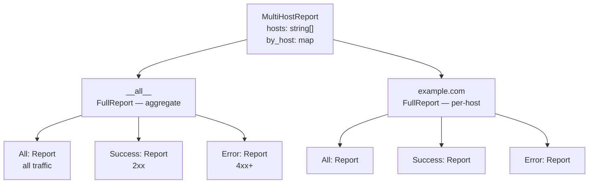

# Spec: Analysis & Aggregation

## Overview

`internal/analyzer` is the core aggregation engine. `Analyze(r io.Reader)` makes a single streaming pass over log entries and returns a `MultiHostReport`.

## Processing Per Entry

1. Extract `client_ip`; fall back to `remote_ip` if absent
2. GeoIP lookup on the original IP → country code + name
3. Anonymize IP (last IPv4 octet zeroed; IPv6 truncated to first 3 groups)
4. Parse User-Agent → browser name + OS name
5. Determine UTC date from `ts` (`YYYY-MM-DD`)
6. Increment all map-based counters for the entry's host and for the aggregate (`__all__`)

## Report Structure



### `Report` Fields

| Field | Type | Limit | Description |
|-------|------|-------|-------------|
| `total_requests` | int | — | Total entries processed |
| `unique_ips` | int | — | Distinct anonymized IPs |
| `total_bytes` | int | — | Sum of `size` fields |
| `avg_response_ms` | float64 | — | `(sum duration / count) × 1000` |
| `status_codes` | NameCount[] | all | Sorted ascending by code |
| `top_pages` | NameCount[] | 15 | Sorted descending by count |
| `browsers` | NameCount[] | 10 | Sorted descending by count |
| `operating_systems` | NameCount[] | 10 | Sorted descending by count |
| `daily_traffic` | DayCount[] | all | Sorted chronologically |
| `top_visitors` | VisitorInfo[] | 10 | Sorted descending by count |
| `countries` | CountryCount[] | 15 | Sorted descending by count |

### Nested Types

```go
type NameCount struct {
    Name  string `json:"name"`
    Count int    `json:"count"`
}

type DayCount struct {
    Date  string `json:"date"`  // YYYY-MM-DD UTC
    Count int    `json:"count"`
}

type VisitorInfo struct {
    IP          string `json:"ip"`           // anonymized
    Count       int    `json:"count"`
    Country     string `json:"country"`      // ISO 3166-1 alpha-2
    CountryName string `json:"country_name"`
}

type CountryCount struct {
    Code  string `json:"code"`   // ISO 3166-1 alpha-2
    Name  string `json:"name"`
    Count int    `json:"count"`
}
```

## Page Filtering

A URI is counted as a page only if **all** of the following hold:

1. HTTP status code < 400 *(inverted for the Error filter: status ≥ 400)*
2. URI does **not** start with: `/css/`, `/js/`, `/img/`, `/fonts/`, `/api`
3. URI does **not** end with: `.css`, `.js`, `.png`, `.jpg`, `.svg`, `.ttf`, `.woff`, `.woff2`, `.ico`

## Traffic Segmentation

All three `Report` objects (All, Success, Error) are populated in a single pass. No re-analysis is needed to switch between views on the frontend.

| Filter | Included status codes |
|--------|-----------------------|
| All | all |
| Success | 200–299 |
| Error | 400–599 |
