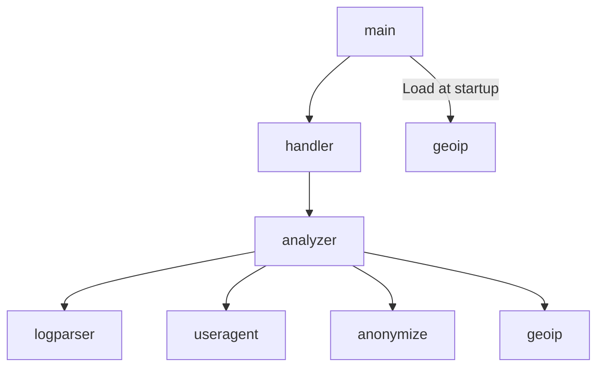

# Spec: Deployment

## Single Binary

CaddyShack compiles to a single Go binary with all frontend assets embedded via the `embed` package. No installation, no configuration files, no external runtime dependencies (GeoIP CSV is optional).

Requires Go 1.22+ (uses method-based routing in `http.ServeMux`).

## CLI Flags

| Flag | Default | Description |
|------|---------|-------------|
| `-addr` | `:8080` | TCP listen address |
| `-geodb` | `./data/dbip-country-lite.csv` | Path to DB-IP Lite CSV for GeoIP |

## Static File Serving

Embedded `static/` directory served by `http.FileServer`:

| URL path | Source |
|----------|--------|
| `/` | `static/index.html` |
| `/css/*` | `static/css/` |
| `/js/*` | `static/js/` |
| `/img/*` | `static/img/` |
| `/vendor/*` | `static/vendor/` (D3.js, topojson-client) |
| `/data/*` | `static/data/` (countries-110m.json) |

## Health Check

`GET /api/health` returns `{"status":"ok"}`. Use for container readiness probes and uptime monitors.

## Docker

Multi-stage `Dockerfile`:
1. **Builder** — compiles the Go binary
2. **Runtime** — minimal image containing only the binary

### Docker Compose (`compose.yml`)

Defines the service with port mapping (`8080:8080`) and optional volume mount for the GeoIP CSV.

### GHCR Images

Published to `ghcr.io/bjblazko/caddyshack` on each tagged release.

Architectures: `linux/amd64`, `linux/arm64`

```sh
# Pull and run
docker run -p 8080:8080 ghcr.io/bjblazko/caddyshack:latest

# With GeoIP
docker run -p 8080:8080 \
  -v /path/to/dbip-country-lite.csv:/data/dbip-country-lite.csv \
  ghcr.io/bjblazko/caddyshack:latest
```

## Package Dependency Graph



No circular dependencies. Each internal package has a single responsibility.
