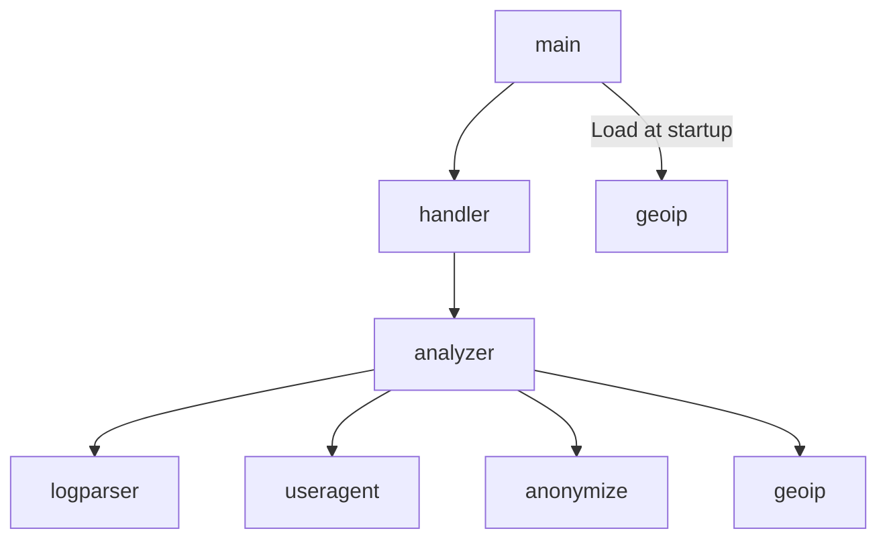

# Spec: Deployment

## Single Binary

CaddyShack compiles to a single Go binary with all frontend assets embedded via the `embed` package. No installation, no configuration files, no external runtime dependencies (GeoIP CSV is optional).

Building from source requires Go 1.26+, the oldest supported Go release (`go` directive in `go.mod`). Release binaries and the container image are built with the version in the `toolchain` directive (currently go1.27.1), which `actions/setup-go` reads. Keep it on a supported, patched release: a build with an outdated toolchain ships its standard-library vulnerabilities.

## CLI Flags

| Flag | Default | Description |
|------|---------|-------------|
| `-addr` | `:8080` | TCP listen address |
| `-geodb` | `./data/dbip-country-lite.csv` | Path to DB-IP Lite CSV for GeoIP |
| `-logdir` | `/var/log/caddy` | Directory of server-side Caddy logs offered under "Log file" |
| `-upload-ttl` | `1h` | Idle time after which an uploaded log file is deleted; must be positive (ADR-010) |

## Static File Serving

Embedded `static/` directory served by `http.FileServer`:

| URL path | Source |
|----------|--------|
| `/` | `static/index.html` |
| `/css/*` | `static/css/` |
| `/js/*` | `static/js/` |
| `/img/*` | `static/img/` |
| `/vendor/*` | `static/vendor/` (D3.js, topojson-client) |
| `/data/*` | `static/data/` (countries-110m.json) |
| `/licenses.html` | "Licenses and thanks", rendered from `static/licenses/credits.json` |
| `/licenses/*` | `credits.json` and the license text of each built-in project; IBM Plex's OFL lies at `/fonts/OFL.txt`. `main_test.go` fails when a file in `static/vendor/`, `static/data/` or `static/fonts/` is not covered by a credit entry, or an entry's license text is not embedded |

## CI and Releases

`.github/workflows/ci.yml` checks every push to `main` and every pull request:
`gofmt`, `go vet`, `go test`, `govulncheck` (pinned version) and the syntax of
`static/js/*.js`. The release workflow (on `v*` tags) calls it first; binaries
and the container image are only built and published when it passes.

## Container Image

Multi-stage build: `golang:1.27-alpine` compiles a static binary (`CGO_ENABLED=0`),
the runtime stage is `scratch` with only `/app/caddyshack`, `/app/LICENSE` and an
empty world-writable `/tmp` for uploads. No shell, libc or other userland is
shipped, so no further licenses (e.g. BusyBox GPL-2.0) apply to the image.

## Health Check

`GET /api/health` returns `{"status":"ok","version":"…"}`. Use for container readiness probes and uptime monitors. The version comes from `-ldflags "-X main.version=<tag>"` (release workflow; Dockerfile build arg `VERSION`).

## Docker

Multi-stage `Dockerfile`:
1. **Builder** — compiles the Go binary
2. **Runtime** — minimal image containing only the binary

### Docker Compose (`compose.yml`)

Defines the service with port mapping (`8080:8080`) and optional volume mount for the GeoIP CSV.

### GHCR Images

Published to `ghcr.io/bjblazko/caddyshack` on each tagged release.

Architectures: `linux/amd64`, `linux/arm64`

```sh
# Pull and run
docker run -p 8080:8080 ghcr.io/bjblazko/caddyshack:latest

# With GeoIP
docker run -p 8080:8080 \
  -v /path/to/dbip-country-lite.csv:/data/dbip-country-lite.csv \
  ghcr.io/bjblazko/caddyshack:latest
```

## Package Dependency Graph


```mermaid
graph TD
    main --> handler
    main -->|"Load at startup"| geoip_s["geoip"]
    handler --> analyzer
    analyzer --> logparser
    analyzer --> useragent
    analyzer --> anonymize
    analyzer --> geoip
```

No circular dependencies. Each internal package has a single responsibility.
